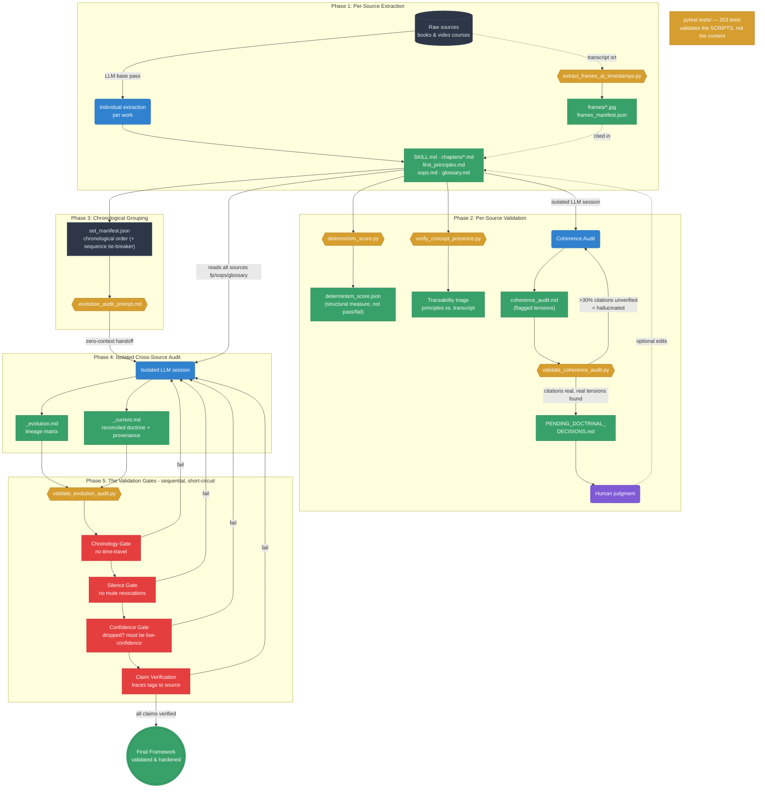

# Knowledge-Compilation Pipeline — Architecture

End-to-end structure that turns a bibliography (books + video courses) into a
consistent, time-traceable doctrine. This diagram is a **corrected** version of
an earlier draft — see "Accuracy notes" at the bottom for what was fixed and
why, so the corrections aren't silently re-introduced later.

## How the pipeline prevents hallucination

1. **Zero-context handoff (isolation)** — both the Coherence Audit (Phase 2)
   and the cross-source Evolution Audit (Phase 4) run in a *fresh* LLM
   session that does not inherit the prep deliberations. This forces a cold
   read and prevents the agreement bias where a model rubber-stamps something
   because it said it earlier.
2. **Rigorous provenance tags** — every rule in the final `<set>_current.md`
   must end in a tag like `[src2/2025-01-01, base: src1/2019-01-01]`.
   If a tag cites a source that doesn't exist or a claim the source text
   doesn't support, `validate_evolution_audit.py` fails the build in Phase 5.
3. **Chronology Gate** — logically forbids an older source from superseding a
   newer one within a concept's lineage (with an explicit `sequence`
   tie-breaker for same-dated sources).
4. **Two distinct failure meanings, never conflated** — a *validator* failure
   (Phase 2 coherence or Phase 5 evolution) means **hallucinated citations →
   regenerate the audit**. A *flagged tension* on the success path means
   **a real doctrinal question → human judgment** (`PENDING_DOCTRINAL_DECISIONS.md`).
   These are different roads; mixing them would let a real contradiction hide
   behind "the script passed."

## Accuracy notes (corrections from the earlier draft)

- **Coherence validator direction fixed.** `validate_coherence_audit.py` only
  checks *citation traceability* (are the flagged Claim A/B quotes real, ≥70%
  verified). Its **failure** means hallucinated citations → regenerate, **not**
  a doctrinal decision. `PENDING_DOCTRINAL_DECISIONS.md` is fed by the audit
  **passing** and surfacing genuine tensions for human review — the earlier
  draft had this arrow backwards.
- **Pytest is not in the content flow.** The 203 tests validate the Python
  scripts themselves; they are not a stage of content validation and were
  wrongly fused with the coherence-validator success path before. Shown
  off to the side here. (Count was also stale at "191".)
- **Video sub-pipeline added.** `extract_frames_at_timestamps.py` → `frames/`
  + `frames_manifest.json` → `## Visual Reference` citations was absent from
  the earlier draft, which read as text-only.
- **Measurement layers added.** `determinism_score.py` (structural
  determinism %, not a pass/fail gate) and `verify_concept_presence.py`
  (principle-vs-transcript traceability triage) were both missing.
- **Confidence Gate label precised.** It specifically rejects a `dropped?`
  transition marked with high confidence — not a vague "requires uncertainty
  flags."
- **Isolation shown for both audits.** The Coherence Audit is isolated too
  (SKILL.md Step 9.6 hands off to a new session), not just the Evolution Audit.
- **Environment de-specified.** The isolated session isn't tied to a specific
  OS ("Ubuntu" was incidental); what matters is that it's context-isolated.
- **Gates are sequential, not parallel.** They short-circuit — the first gate
  to fail returns non-zero; a failure routes back to regeneration, it doesn't
  "fix the gate."
