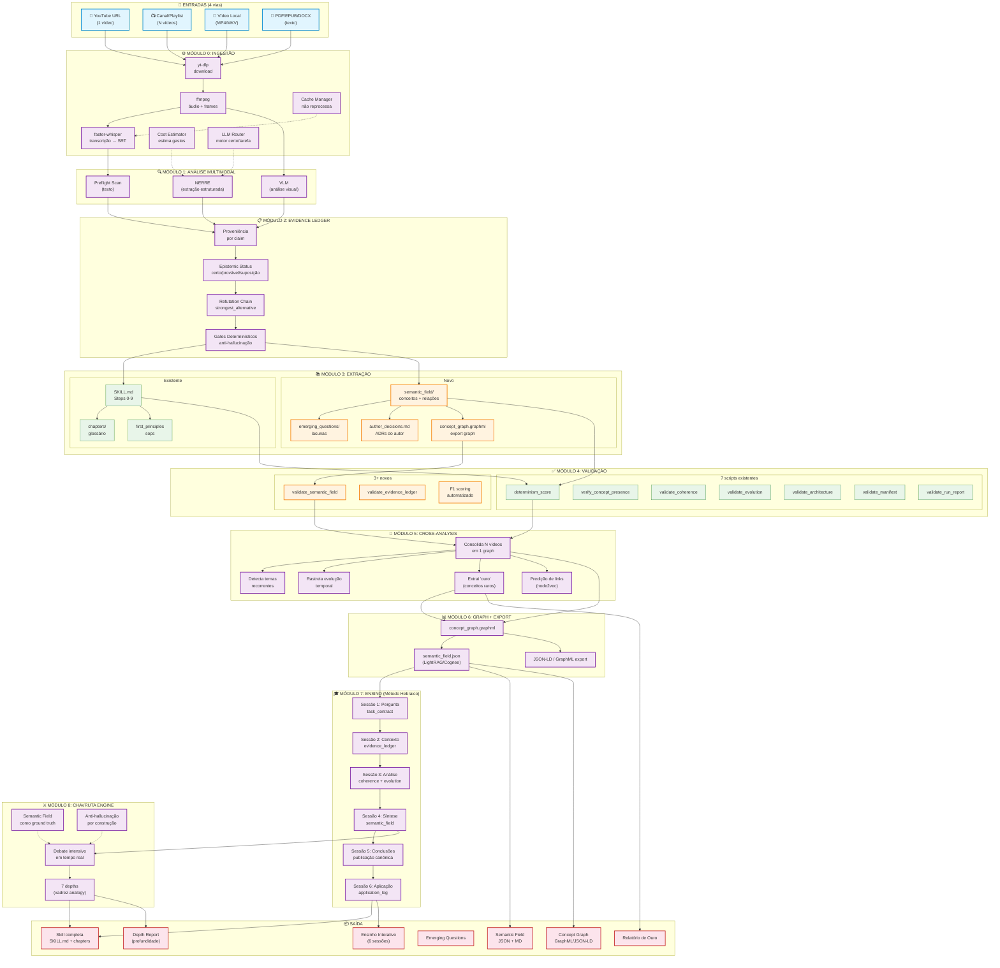
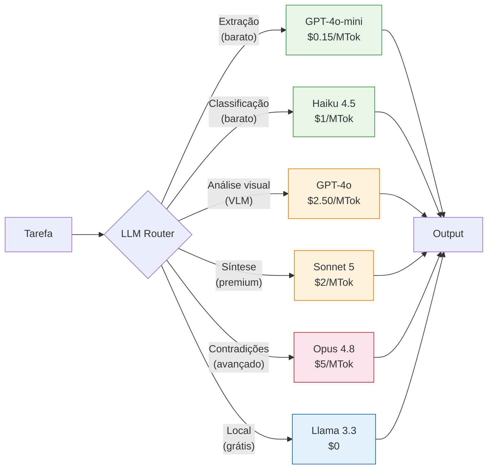
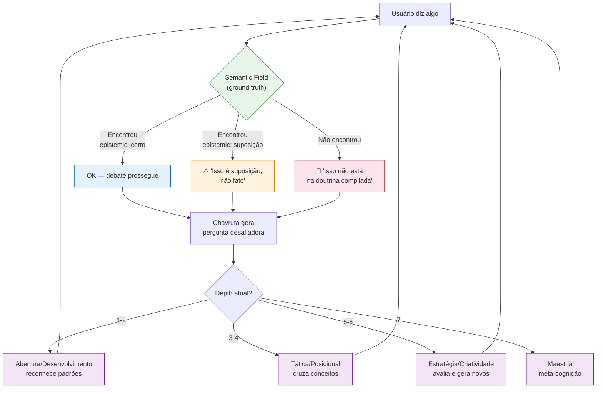
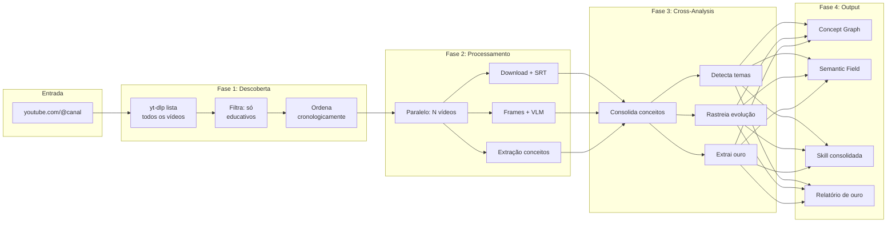
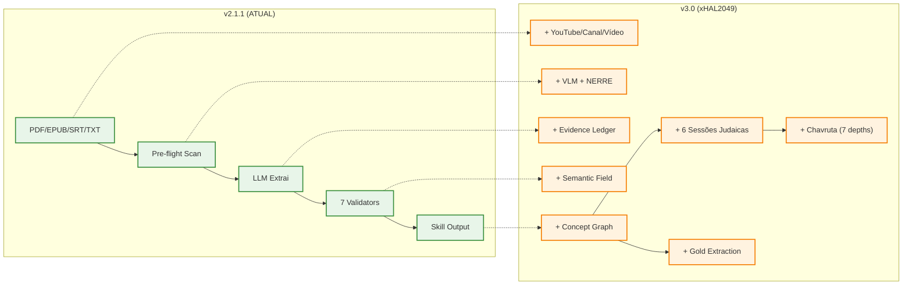

# xHAL2049 — Diagrama de Arquitetura (Mermaid)

> O minerador de conhecimento humano — processa canais inteiros do YouTube e extrai o ouro.

## Visão Geral do Fluxo Completo

---

## Fluxo de Decisão (LLM Router)

---

## Fluxo Chavruta (Debate + Depth)

---

## Fluxo de Ingestão Massiva (Canal)

---

## Comparação: ATUAL vs. xHAL2049

---

## Para usar

1. Copie para `docs/xhal2049-architecture.md`
2. **GitHub/GitLab**: visualiza automaticamente
3. **Mermaid Live**: cole em [mermaid.live](https://mermaid.live)
4. **VS Code**: extensão "Mermaid Preview"
5. **CLI**: `mmdc -i xhal2049-architecture.md -o xhal2049-architecture.png`
